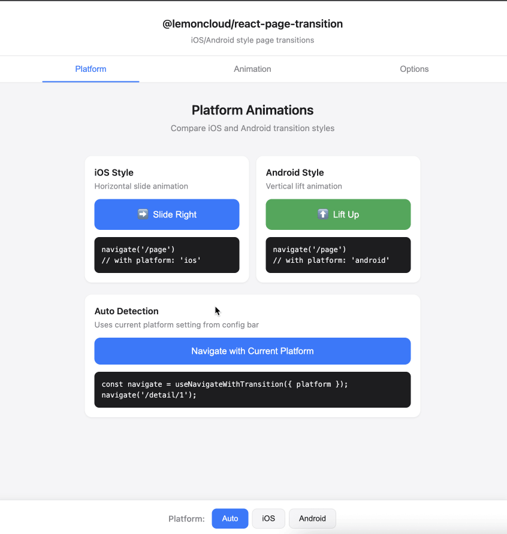
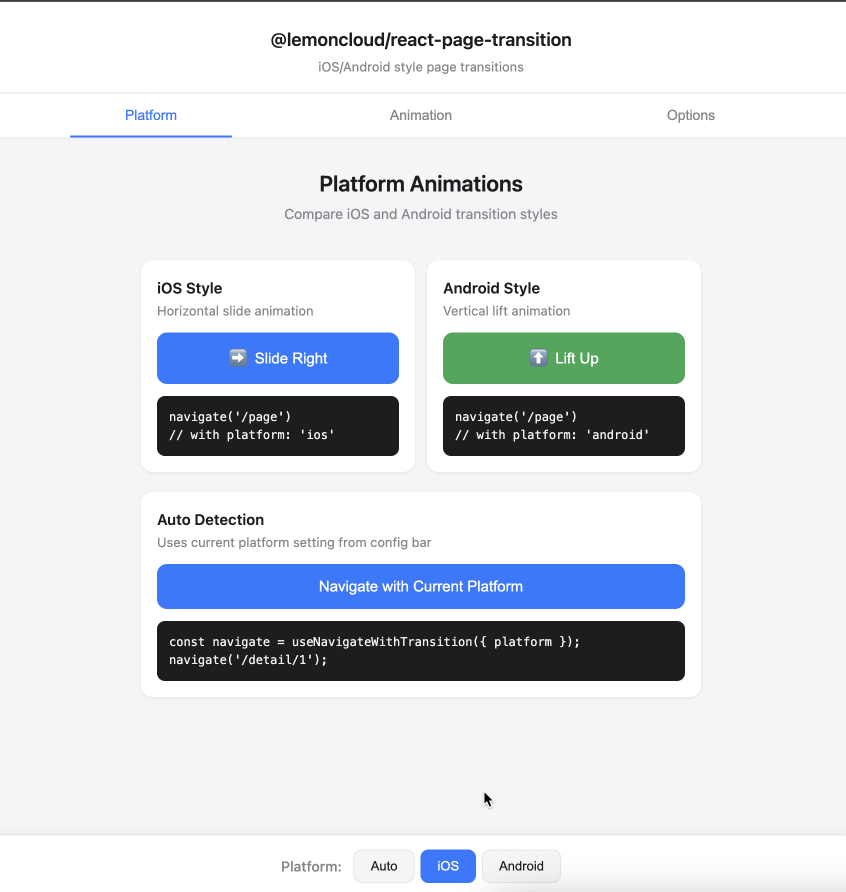

# @lemoncloud/react-page-transition

[](https://www.npmjs.com/package/@lemoncloud/react-page-transition)
[](https://github.com/lemoncloud-io/react-page-transition/actions/workflows/ci.yml)
[](https://bundlephobia.com/package/@lemoncloud/react-page-transition)
[](https://opensource.org/licenses/MIT)
[](https://www.typescriptlang.org/)
[](https://react.dev/)

**Mobile-app-like page transition animations for React apps using the [View Transitions API](https://developer.mozilla.org/en-US/docs/Web/API/View_Transitions_API).**

| iOS Style | Android Style |
|:---------:|:-------------:|
|  |  |
| Horizontal slide (350ms) | Vertical lift (100ms) |

---

## What This Library Does

Adds iOS/Android-style page transition animations to React apps. Works in any browser that supports View Transitions API.

- Page transition animations (slide, lift, fade, zoom)
- Platform auto-detection (iOS vs Android style)
- Works with React Router's `useNavigate`
- TypeScript support
- **Not a navigation library** - no gesture handling, no screen stack management

---

## How It Works

Uses the browser's [View Transitions API](https://developer.mozilla.org/en-US/docs/Web/API/View_Transition_API) to animate page changes.

**Browser Support:** Chrome 111+, Edge 111+, Safari 18+, Firefox 133+

Unsupported browsers fall back to instant navigation.

---

## Installation

```bash
npm install @lemoncloud/react-page-transition
# or
pnpm add @lemoncloud/react-page-transition
# or
yarn add @lemoncloud/react-page-transition
```

### Peer Dependencies

| Package | Version |
|---------|---------|
| react | >= 18.0.0 |
| react-router-dom | >= 6.0.0 |

---

## Quick Start

### 1. Import CSS

```tsx
// main.tsx
import '@lemoncloud/react-page-transition/styles.css';
```

### 2. Replace useNavigate

```tsx
import { useNavigateWithTransition } from '@lemoncloud/react-page-transition';

const MyComponent = () => {
    const navigate = useNavigateWithTransition();

    return (
        <>
            <button onClick={() => navigate('/settings')}>Settings</button>
            <button onClick={() => navigate(-1)}>Back</button>
        </>
    );
};
```

Done. Page transitions will now animate.

---

## Platform Detection

Platform is detected automatically from user agent. No configuration needed for most use cases.

- **iOS devices** - Horizontal slide (350ms)
- **Android devices** - Vertical lift (100ms)
- **Desktop** - iOS-style slide (default)

### Custom Platform Detection

For WebView apps (Capacitor, React Native, Cordova), you can provide a custom detector:

```tsx
const navigate = useNavigateWithTransition({
    detectPlatform: () => {
        // Return 'ios' | 'android' | undefined
        return yourPlatformDetectionLogic();
    }
});
```

---

## API Reference

### `useNavigateWithTransition(config?)`

A wrapper around React Router's `useNavigate` that adds view transition support.

#### Config Options

| Option | Type | Default | Description |
|--------|------|---------|-------------|
| `platform` | `'ios' \| 'android' \| 'auto'` | `'auto'` | Animation style |
| `detectPlatform` | `() => 'ios' \| 'android' \| undefined` | - | Custom platform detector |

#### Navigate Options

| Option | Type | Default | Description |
|--------|------|---------|-------------|
| `transition` | `boolean` | `true` | Enable/disable animation |
| `direction` | `'forward' \| 'back'` | auto | Override animation direction |
| `animation` | `'slide' \| 'lift' \| 'fade' \| 'zoom' \| 'none'` | platform-based | Animation type |
| `replace` | `boolean` | `false` | Replace history (disables transition by default) |
| `state` | `any` | - | Router state |

> **Note:** `replace: true` disables transitions by default - ideal for tab bars. Override with `transition: true`.

#### Return Value

Returns `Promise<void>` that resolves when the transition animation completes.

```tsx
await navigate('/settings');
console.log('Transition complete!');
```

#### Examples

```tsx
const navigate = useNavigateWithTransition();

// Basic navigation
navigate('/settings');              // Forward with animation
navigate(-1);                       // Back with animation

// Control transitions
navigate('/tabs/home', { replace: true });                  // Tab switch, no animation
navigate('/tabs/home', { replace: true, transition: true }); // Tab switch with animation
navigate('/reset', { transition: false });                  // Force no animation

// Animation types
navigate('/modal', { animation: 'fade' });    // Crossfade (good for modals)
navigate('/gallery', { animation: 'zoom' });  // Scale with fade (good for galleries)
navigate('/page', { animation: 'slide' });    // Force iOS-style slide
navigate('/page', { animation: 'lift' });     // Force Android-style lift

// Direction override (for path-based back navigation)
navigate('/home', { direction: 'back' });     // Back animation to path

// Platform override
const navigate = useNavigateWithTransition({ platform: 'ios' });     // Always iOS style
const navigate = useNavigateWithTransition({ platform: 'android' }); // Always Android style
```

### `useGoBack(config?)`

Convenience hook for back navigation.

```tsx
import { useGoBack } from '@lemoncloud/react-page-transition';

const Header = () => {
    const goBack = useGoBack();
    return <button onClick={goBack}>Back</button>;
};
```

### `detectPlatform()`

Utility to detect platform from user agent.

```tsx
import { detectPlatform } from '@lemoncloud/react-page-transition';

const platform = detectPlatform();
// Returns: 'ios' | 'android' | undefined (desktop)
```

### Types

```tsx
import type {
    PlatformType,              // 'ios' | 'android'
    NavigationDirection,       // 'forward' | 'back'
    AnimationType,             // 'slide' | 'lift' | 'fade' | 'zoom' | 'none'
    PageTransitionConfig,      // { platform?, detectPlatform? }
    TransitionNavigateOptions, // NavigateOptions & { transition?, direction?, animation? }
    NavigateWithTransitionFn,  // (to, options?) => Promise<void>
} from '@lemoncloud/react-page-transition';
```

---

## Animation Styles

| Style | Duration | Use Case |
|-------|----------|----------|
| `slide` | 350ms | iOS default |
| `lift` | 100ms | Android default |
| `fade` | 200ms | Modals |
| `zoom` | 250ms | Galleries |

---

## Troubleshooting

**Animations not working?**
1. Check CSS import: `import '@lemoncloud/react-page-transition/styles.css'`
2. Check browser support (Chrome 111+, Safari 18+, Edge 111+, Firefox 133+)

---

## Development

```bash
git clone https://github.com/lemoncloud-io/react-page-transition.git
cd react-page-transition
pnpm install
pnpm dev          # Watch mode
pnpm test         # Run tests
pnpm build        # Build library
```

### Run Example

```bash
pnpm --filter @example/basic dev
# Open http://localhost:3000
```

---

## Contributing

1. Fork the repository
2. Create feature branch (`git checkout -b feature/amazing`)
3. Commit changes (`git commit -m 'feat: add amazing feature'`)
4. Push (`git push origin feature/amazing`)
5. Open Pull Request

We use [Conventional Commits](https://www.conventionalcommits.org/) for automatic versioning.

---

## License

MIT © [LemonCloud](https://lemoncloud.io)

---

## Related

- [View Transitions API - MDN](https://developer.mozilla.org/en-US/docs/Web/API/View_Transitions_API)
- [View Transitions API - Chrome Developers](https://developer.chrome.com/docs/web-platform/view-transitions)
- [React Router](https://reactrouter.com/)
